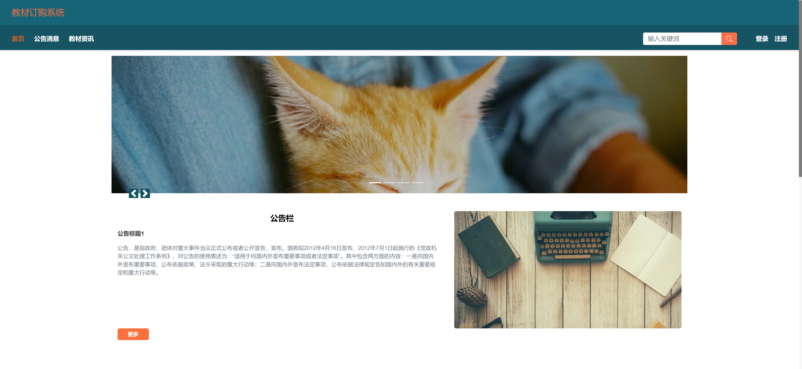
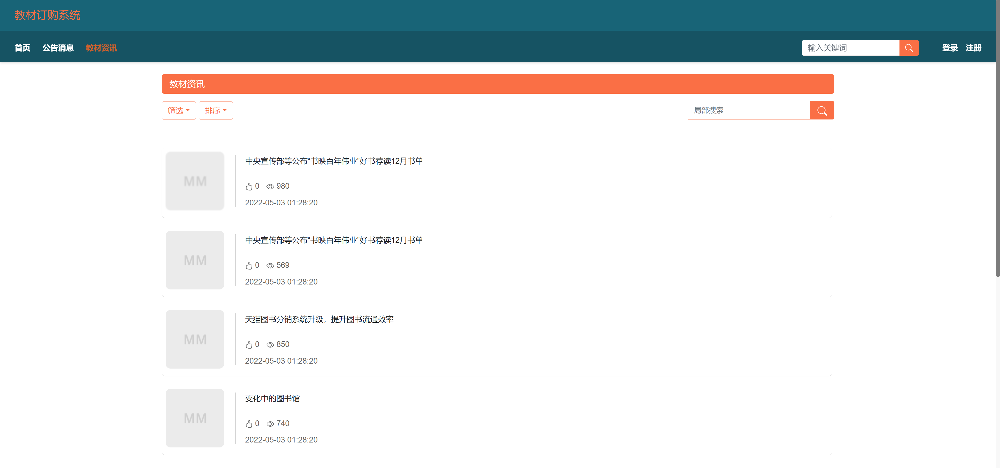
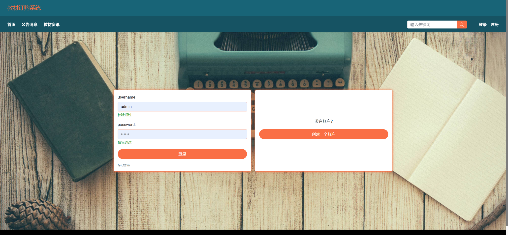
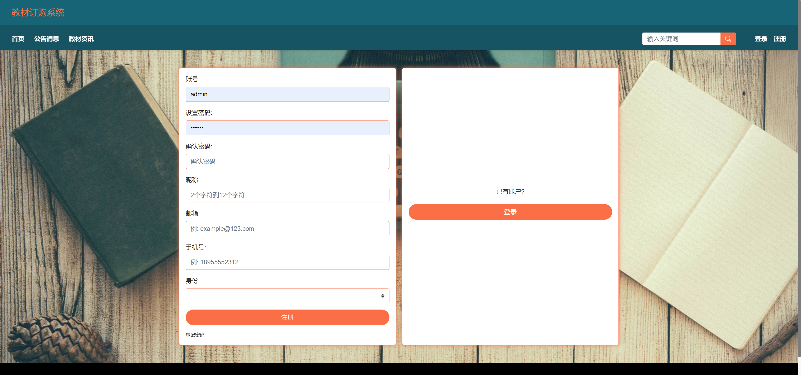
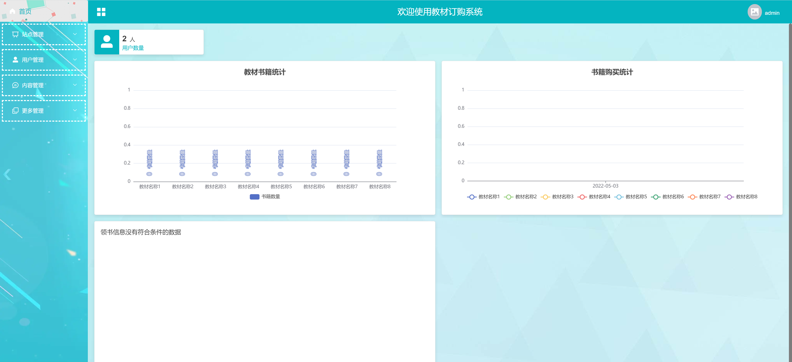
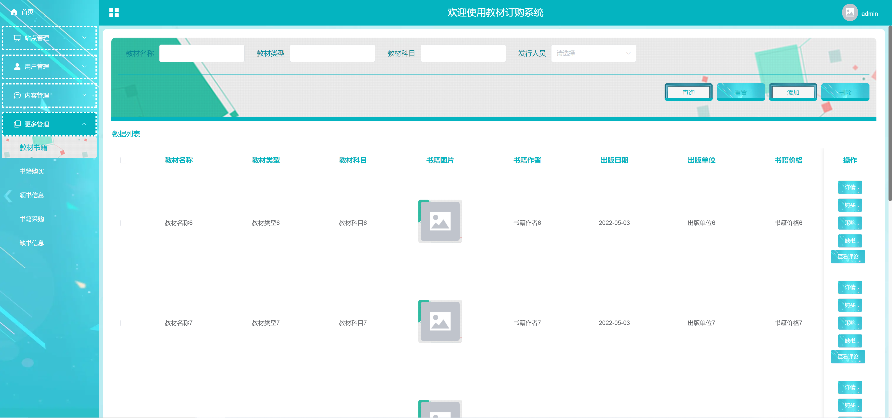

<h1 align="center">高校教材订购管理系统</h1>

## 简介
高校教材订购管理系统：角色分为管理员、用户；功能包括教材资讯管理、订单处理、用户个性化管理、统计分析和注册登录，界面简洁、模块划分明确，方便用户操作与管理。    --计算机毕业设计源码；毕设源码；java毕业设计源码

## 联系方式

<h3 align="center">获取完整代码与数据库文件 + 微信：bysj5151 QQ: 86050149 QQ群: 783742310</h3>

<h3 align="center">可帮忙远程部署 包运行成功！提供远程部署、修改代码、设计文档指导、代码讲解等服务！</h3>

## 功能介绍（完整见运行截图）
管理员：管理员可以通过登录界面进入系统，管理教材信息，包括添加、修改、删除教材，并管理用户账户和权限。站点管理模块显示当前在线用户数量，并提供书籍种类和购买信息的统计图表帮助管理员了解库存情况。管理员还可以访问订单处理模块，负责订单的生成、审核及发货状态的管理，确保教材订购流程顺畅。
用户：用户可注册账户或使用已注册信息登录系统，在首页浏览公告消息和教材资讯。用户可以通过搜索和筛选功能查找特定教材，根据需求购买或订购教材。在个人中心，用户可查看和修改个人信息，查询订单状态并管理地址。通过系统提供的筛选和操作按钮，用户能够方便地根据教材名称、类型和发行商等条件进行选择和购买，实现高效的教材订购。

## 运行截图

本代码来源于网络,仅供学习参考使用!

